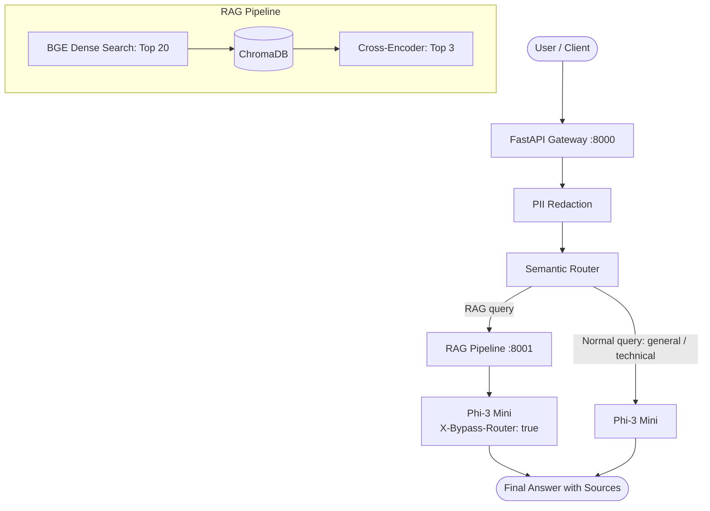

# Ericsson Local GenAI Stack: SLM Gateway & RAG Pipeline

A privacy-focused, fully local Generative AI stack combining an **OpenAI-Compatible SLM Gateway** with a **RAG Pipeline (Dense Retrieval + Cross-Encoder Re-Ranking)**. Built to run locally with open-weights models (`microsoft/Phi-3-mini-4k-instruct`, `BAAI/bge-small-en-v1.5`, `BAAI/bge-reranker-base`), ensuring zero cloud data egress and complete data privacy.

---

## 1. System Architecture

```
                    USER
                      │
                      ▼
              ┌──────────────┐
              │ FastAPI      │
              │ Gateway      │
              └──────┬───────┘
                     │
                     ▼
               PII Redaction
                     │
                     ▼
              Semantic Router
                 /       \
                /         \
          Normal query    RAG query
              │              │
              ▼              ▼
          Phi-3 Mini     RAG Pipeline
                             │
                       ┌─────┴─────┐
                       │           │
                    Documents    Query
                       │           │
                     Parse       Embed
                       │           │
                    Chunk      ChromaDB
                       │           │
                    Embed      Top 20
                       │           │
                    Store     Reranker
                                   │
                                  Top 3
                                   │
                                   ▼
                              Phi-3 Mini
                                   │
                                   ▼
                                Answer
```



---

## 2. Quickstart

### Prerequisites
- Python 3.10
- `uv` package manager (or standard virtualenv)
- NVIDIA GPU recommended for in-process 4-bit model serving (or CPU fallback via `BACKEND=openai_compatible`)

### Run Services
```bash
# Terminal 1: Start RAG Service (Port 8001)
uv run uvicorn rag_service.main:app --host 0.0.0.0 --port 8001

# Terminal 2: Start SLM Gateway (Port 8000)
uv run uvicorn slm_gateway.main:app --host 0.0.0.0 --port 8000
```

### Run the Demo
```bash
# Live 4-scene demo: health check, normal chat, PII masking, RAG query with sources
uv run python scripts/demo.py

# Or inspect the empirical benchmark table directly:
uv run python scripts/demo.py --benchmark-only
```

### Run the Tests
```bash
# Run all unit and integration tests:
uv run pytest gateway/tests rag/tests -m "not slow"
```

---

## 3. Key Evaluation Results (Supporting Evidence)

### 3.1 Chunking Strategy & Re-Ranking
Evaluated across 36 ground-truth questions on a small synthetic corpus (3 PDFs / 5 pages from `scripts/create_eval_docs.py`):

| Strategy | Re-ranker | Total Chunks | Avg Length | Hit@1 (%) | Hit@3 (%) | MRR | Latency (ms) |
|---|:---:|:---:|:---:|:---:|:---:|:---:|:---:|
| `character` | Off | 16 | 422.1 ch | 86.11% | 97.22% | 0.9028 | 30.3 |
| `character` | On | 16 | 422.1 ch | 83.33% | 97.22% | 0.9028 | 223.5 |
| `structure` | Off | 10 | 621.0 ch | 86.11% | 94.44% | 0.9028 | 29.1 |
| **`structure`** | **On** | **10** | **621.0 ch** | **100.00%** | **100.00%** | **1.0000** | **235.3** |
| `semantic` | Off | 16 | 387.2 ch | 80.56% | 94.44% | 0.8611 | 26.7 |
| **`semantic`** | **On** | **16** | **387.2 ch** | **94.44%** | **97.22%** | **0.9583** | **238.6** |

*Takeaways*:
- Cross-encoder re-ranking improved Hit@1 for structure (+13.9%) and semantic (+13.9%).
- Re-ranking did not improve character chunking on Hit@1 (86.1% vs 83.3%) because severed sentences lack full context for cross-attention.
- Re-ranking adds cross-encoder inference latency (~200ms).

### 3.2 Semantic Intent Router Accuracy
Evaluated on 48 out-of-distribution queries with 0 training exemplar leakage (`eval/datasets/router_eval.jsonl`):

| Intent | Support | Precision | Recall | F1-Score |
|---|:---:|:---:|:---:|:---:|
| `general` | 16 | 100.0% | 93.8% | 96.8% |
| `technical` | 16 | 88.2% | 93.8% | 90.9% |
| `rag` | 16 | 93.8% | 93.8% | 93.8% |
| **Overall** | **48** | **93.75% Accuracy (45/48)** | — | — |

*Operating threshold: `0.55`. Mean classification latency: ~11.6ms.*

---

## 4. Documentation & Mentor Preparation
- [docs/PRESENTATION_SCOPE.md](docs/PRESENTATION_SCOPE.md): Strict presentation boundaries (Must Explain vs. Ignore).
- [docs/STUDY_FILES.md](docs/STUDY_FILES.md): Concise list of source files to study with rationale.
- [docs/DEMO_SCRIPT.md](docs/DEMO_SCRIPT.md): 10-minute 12-step presentation script with talking points.
- [docs/ARCHITECTURE.md](docs/ARCHITECTURE.md): Architecture diagram and request flow.
- [docs/SOLUTION_GATEWAY.md](docs/SOLUTION_GATEWAY.md): Gateway design, API spec, and limitations.
- [docs/SOLUTION_RAG.md](docs/SOLUTION_RAG.md): RAG design, chunking strategies, and limitations.
