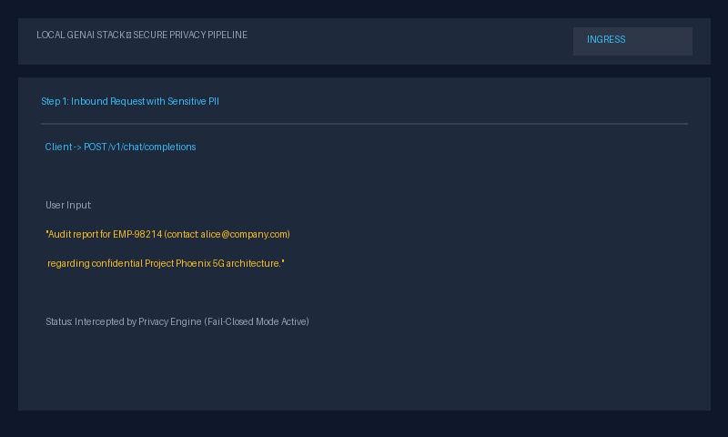

# Local GenAI Stack: SLM Gateway & Hybrid RAG Pipeline

A privacy-focused, fully local Generative AI stack combining an **OpenAI-Compatible SLM Gateway** with a **Two-Stage Hybrid RAG Pipeline (BM25 + Dense Vectors + Cross-Encoder Re-Ranking)**. Built to run locally with open-weights models (`microsoft/Phi-3-mini-4k-instruct`, `BAAI/bge-small-en-v1.5`, `BAAI/bge-reranker-base`), ensuring on-device execution without cloud data egress.


*Illustrative animation of the request lifecycle.*

---

## 1. System Architecture

```
                    USER / CLIENT
                          │
                          ▼
                  ┌──────────────┐
                  │ FastAPI      │
                  │ Gateway      │
                  └──────┬───────┘
                         │
                         ▼
                   PII Redaction (Presidio + Codename Deny-list)
                         │
                         ▼
                  Semantic Router (BGE Embeddings)
                     /       \
                    /         \
              Normal query    RAG query
                  │              │
                  ▼              ▼
              Phi-3 Mini     Hybrid RAG Pipeline
                                 │
                           ┌─────┴─────┐
                           │           │
                        Documents    Query
                           │           │
                         Parse       Hybrid Search
                           │       ┌───┴───┐
                        Chunk      │ BM25  │ Dense (ChromaDB)
                           │       └───┬───┘
                        Embed          │
                           │      Reciprocal Rank Fusion (RRF)
                        Store          │
                                   Top Chunks
                                       │
                               Cross-Encoder Reranker
                                       │
                                     Top 3
                                       │
                                       ▼
                                   Phi-3 Mini
                                       │
                                       ▼
                                    Answer
```


---

## 2. Quickstart

### Prerequisites
- Python 3.10
- `uv` package manager (or standard virtualenv)
- NVIDIA GPU recommended for in-process 4-bit model serving (or CPU fallback via `BACKEND=openai_compatible`)

### Run Services
```bash
# Terminal 1: Start RAG Service (Port 8001)
uv run --project rag uvicorn rag_service.main:app --host 0.0.0.0 --port 8001

# Terminal 2: Start SLM Gateway (Port 8000)
uv run --project gateway uvicorn slm_gateway.main:app --host 0.0.0.0 --port 8000
```

### Interactive Web Playground
When the Gateway is running on port 8000, visit the interactive Web Playground directly in your browser:
```text
http://localhost:8000/
http://localhost:8000/playground
```
Features:
- **Live SSE Token Streaming**: Real-time typewriter effect with token generation.
- **PII Sanitizer Lab**: Side-by-side comparison of raw prompts vs redacted model inputs with colored entity pills.
- **Semantic Intent Radar**: Live visualization of intent similarity scores and threshold fallback.
- **Hybrid RAG Inspector**: Query search showing dense, BM25, RRF, and cross-encoder scores per chunk.
- **Document Ingest & Corpus Manager**: Drag-and-drop document upload with multi-strategy chunk indexing and real-time inventory management.
- **Prometheus Scrape Viewer**: Inspect `/metrics` directly from the UI.

### Run the Benchmarks & Scorecard
```bash
# View the unified benchmark scorecard dashboard:
uv run python scripts/run_benchmarks.py --scorecard-only

# Or execute specific benchmark pipelines:
uv run python scripts/run_benchmarks.py --suite pii       # PII recall & false positives
uv run python scripts/run_benchmarks.py --suite router    # Intent classification & threshold sweep
uv run python scripts/run_benchmarks.py --suite chunking  # Multi-strategy chunking & re-ranking
uv run python scripts/run_benchmarks.py --suite hybrid    # BM25 + BGE dense RRF benchmark
```

### Run the Demo
```bash
# Live 4-scene demo: health check, normal chat, PII masking, RAG query with sources
uv run python scripts/demo.py

# Or inspect the empirical benchmark table directly:
uv run python scripts/demo.py --benchmark-only
```

### Run the Tests
```bash
# Run all unit and integration tests:
uv run pytest gateway/tests rag/tests -m "not slow"
```

---

## 3. Key Evaluation Results (Supporting Evidence)

### 3.1 Chunking Strategy & Re-Ranking
Evaluated across 36 ground-truth questions on a small synthetic corpus (3 PDFs / 5 pages from `scripts/create_eval_docs.py`):

| Strategy | Re-ranker | Total Chunks | Avg Length | Hit@1 (%) | Hit@3 (%) | MRR | Latency (ms) |
|---|:---:|:---:|:---:|:---:|:---:|:---:|:---:|
| `character` | Off | 16 | 423.6 ch | 86.11% | 100.00% | 0.9213 | 16.0 |
| `character` | On | 16 | 423.6 ch | 88.89% | 97.22% | 0.9306 | 1025.1 |
| `structure` | Off | 10 | 623.6 ch | 94.44% | 100.00% | 0.9722 | 15.5 |
| **`structure`** | **On** | **10** | **623.6 ch** | **100.00%** | **100.00%** | **1.0000** | **1069.9** |
| `semantic` | Off | 16 | 388.7 ch | 88.89% | 100.00% | 0.9352 | 15.9 |
| **`semantic`** | **On** | **16** | **388.7 ch** | **94.44%** | **97.22%** | **0.9583** | **1175.0** |

*Takeaways*:
- Cross-encoder re-ranking improved Hit@1 for structure (+5.56 pp) and semantic (+5.55 pp).
- Re-ranking character chunking improved Hit@1 (+2.78 pp), but reduced Hit@3 (-2.78 pp).
- Dense search lookup alone averaged ~15-16 ms on CPU; adding neural cross-encoder re-ranking on CPU added ~1,000-1,160 ms per query (measured on CPU without GPU acceleration).

### 3.2 Hybrid Retrieval & Reciprocal Rank Fusion (RRF)
Evaluated across 24 test queries (12 exact keyword/acronym + 12 conceptual paraphrase) over 4 technical documents (`eval/datasets/hybrid_eval.jsonl`):

| Configuration | Re-Ranker | RRF $k$ | Keyword Hit@1 | Conceptual Hit@1 | Overall Hit@1 | Overall Hit@3 | MRR | Latency (ms) |
|:---|:---:|:---:|:---:|:---:|:---:|:---:|:---:|:---:|
| **BM25 Lexical Only** | Off | — | **100.0%** | **41.7%** | **70.83%** | 75.00% | **0.7292** | 0.2 |
| **BGE Dense Vector Only** | Off | — | 91.7% | 33.3% | 62.50% | 75.00% | 0.6806 | 17.4 |
| **Hybrid (BM25 + Dense RRF)** | Off | 60 | 91.7% | **41.7%** | 66.67% | 75.00% | 0.7083 | 17.6 |
| **Hybrid + Cross-Encoder** | **On** | **60** | **100.0%** | 25.0% | 62.50% | **79.17%** | 0.7014 | 1735.4 |

*Takeaways*:
- On this 24-query set, BM25 alone matched or beat the hybrid configurations on Hit@1 (70.83% vs 66.67%) and MRR (0.7292 vs 0.7083).
- Adding the `bge-reranker-base` cross-encoder raised Hit@3 by one query (75.0% to 79.17%), but lowered conceptual Hit@1 (41.7% to 25.0%) and overall Hit@1 (66.67% to 62.5%).
- With 24 queries, one query represents approximately 4.17 pp, so these differences reflect shifts of only one or two queries and are not statistically conclusive.

### 3.3 Semantic Intent Router Accuracy
Evaluated on 48 held-out synthetic queries written by the author with 0 training exemplar leakage (`eval/datasets/router_eval.jsonl`):

| Intent | Support | Precision | Recall | F1-Score |
|---|:---:|:---:|:---:|:---:|
| `general` | 16 | 100.0% | 93.8% | 96.8% |
| `technical` | 16 | 88.2% | 93.8% | 90.9% |
| `rag` | 16 | 93.8% | 93.8% | 93.8% |
| **Overall** | **48** | **93.75% Accuracy (45/48)** | — | — |

*Operating threshold: `0.55`. Mean classification latency: `12.76 ms` (P50: `12.15 ms`, P95: `16.48 ms`) on CPU.*

### 3.4 Findings and Caveats
- **Evaluation sets are small and author-written**: The chunking evaluation used 3 PDFs / 5 pages and 36 questions; the hybrid evaluation used 4 technical documents / 16 chunks and 24 queries; the router evaluation used 48 queries.
- **Hybrid retrieval vs. BM25**: On this small test set, hybrid fusion did not clearly outperform BM25 alone on Hit@1 or MRR. A larger, diverse technical corpus is required to determine whether hybrid retrieval provides a net benefit.
- **Hardware context**: All retrieval, embedding, and cross-encoder benchmarks were executed on CPU.
- **Document parsing and OCR**: Digital text PDFs are parsed directly via PyMuPDF. Scanned pages fall back to Tesseract OCR only when Tesseract is installed on the host (or in the Docker image); otherwise scanned PDFs with no extractable text are rejected with HTTP 400. OCR quality was tested only on synthetic test fixtures and sample slide PDFs with Tesseract 5.x on Windows (mocked in CI); real-world scan accuracy is not benchmarked.

---

## 4. Documentation & Architecture Reference
- [docs/KNOWN_LIMITATIONS.md](docs/KNOWN_LIMITATIONS.md): Operational boundaries and trade-offs catalog.
- [docs/ARCHITECTURE.md](docs/ARCHITECTURE.md): Architecture diagram and request flow.
- [docs/SOLUTION_GATEWAY.md](docs/SOLUTION_GATEWAY.md): Gateway design, API spec, and limitations.
- [docs/SOLUTION_RAG.md](docs/SOLUTION_RAG.md): RAG design, chunking strategies, and limitations.

---

## 5. License
Distributed under the [MIT License](LICENSE).
