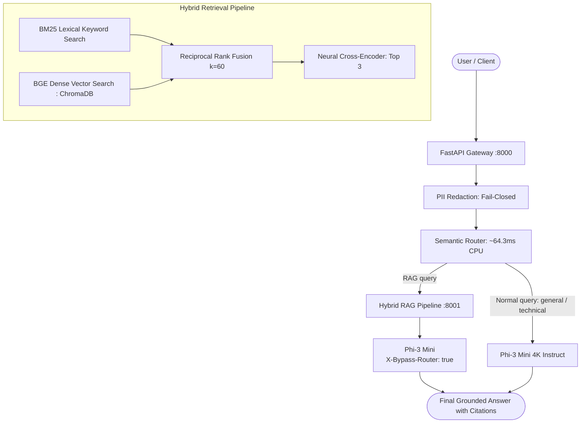

# Local GenAI Stack: SLM Gateway & Hybrid RAG Pipeline

A privacy-focused, fully local Generative AI stack combining an **OpenAI-Compatible SLM Gateway** with a **Two-Stage Hybrid RAG Pipeline (BM25 + Dense Vectors + Cross-Encoder Re-Ranking)**. Built to run locally with open-weights models (`microsoft/Phi-3-mini-4k-instruct`, `BAAI/bge-small-en-v1.5`, `BAAI/bge-reranker-base`), enabling on-device execution without cloud data egress.


*Note: The animation above is a script-generated illustrative mockup of the request lifecycle (`scripts/generate_demo_gif.py`).*
> **TODO**: Replace illustrative animation with a real screen recording of the Web Playground at `assets/playground.gif`.

---

## 1. System Architecture

```
                    USER / CLIENT
                          │
                          ▼
                  ┌──────────────┐
                  │ FastAPI      │
                  │ Gateway      │
                  └──────┬───────┘
                         │
                         ▼
                   PII Redaction (Presidio + Codename Deny-list)
                         │
                         ▼
                  Semantic Router (BGE Embeddings)
                     /       \
                    /         \
              Normal query    RAG query
                  │              │
                  ▼              ▼
              Phi-3 Mini     Hybrid RAG Pipeline
                                 │
                           ┌─────┴─────┐
                           │           │
                        Documents    Query
                           │           │
                         Parse       Hybrid Search
                           │       ┌───┴───┐
                        Chunk      │ BM25  │ Dense (ChromaDB)
                           │       └───┬───┘
                        Embed          │
                           │      Reciprocal Rank Fusion (RRF)
                        Store          │
                                   Top Chunks
                                       │
                               Cross-Encoder Reranker
                                       │
                                     Top 3
                                       │
                                       ▼
                                   Phi-3 Mini
                                       │
                                       ▼
                                    Answer
```



---

## 2. Quickstart

### Prerequisites
- Python 3.10
- `uv` package manager
- NVIDIA GPU recommended for in-process 4-bit model serving (or CPU fallback via `BACKEND=openai_compatible`)

### Installation & Environment Setup
```bash
# Clone the repository and configure environment variables
cp .env.example .env

# Standard installation (GPU / CUDA 13.0 wheels):
uv sync --all-packages --all-groups

# CPU-Only Installation Path:
# If you are on a CPU-only machine or prefer lightweight CPU PyTorch wheels:
uv sync --all-packages --all-groups --no-install-package torch
uv pip install torch --index-url https://download.pytorch.org/whl/cpu
```

### Configuration & Security
Key settings in `.env` (refer to `.env.example` for the complete list):
- `CORS_ALLOW_ORIGINS`: Comma-separated list of allowed web origins (default: `http://localhost:8000,http://localhost:8001`). Replaces insecure wildcard configurations.
- `PII_FAIL_MODE`: Set to `closed` (default: aborts gateway startup if Presidio fails to initialize) or `open` (logs warning and continues).
- `GATEWAY_API_KEY`: Optional Bearer authentication secret. If set, requires `Authorization: Bearer <key>`.

### Run Services
```bash
# Terminal 1: Start RAG Service (Port 8001)
uv run --project rag uvicorn rag_service.main:app --host 0.0.0.0 --port 8001

# Terminal 2: Start SLM Gateway (Port 8000)
uv run --project gateway uvicorn slm_gateway.main:app --host 0.0.0.0 --port 8000
```

### Interactive Web Playground
When the Gateway is running on port 8000, visit the interactive Web Playground directly in your browser:
```text
http://localhost:8000/
http://localhost:8000/playground
```
Features:
- **Live SSE Token Streaming**: Real-time token streaming for local model inference, and replayed word streaming for RAG responses.
- **PII Sanitizer Lab**: Side-by-side comparison of raw prompts vs redacted model inputs with colored entity pills.
- **Semantic Intent Radar**: Live visualization of intent similarity scores and threshold fallback.
- **Hybrid RAG Inspector**: Query search showing dense, BM25, RRF, and cross-encoder scores per chunk.
- **Document Ingest & Corpus Manager**: Drag-and-drop document upload with multi-strategy chunk indexing and real-time inventory management.
- **Prometheus Scrape Viewer**: Inspect `/metrics` directly from the UI.

### Run the Benchmarks & Scorecard
```bash
# View the unified benchmark scorecard dashboard:
uv run python scripts/run_benchmarks.py --scorecard-only

# Or execute specific benchmark pipelines:
uv run python scripts/run_benchmarks.py --suite pii       # PII recall & false positives
uv run python scripts/run_benchmarks.py --suite router    # Intent classification & threshold sweep
uv run python scripts/run_benchmarks.py --suite chunking  # Multi-strategy chunking & re-ranking
uv run python scripts/run_benchmarks.py --suite hybrid    # BM25 + BGE dense RRF benchmark
```

### Run the Demo
```bash
# Live 4-scene demo: health check, normal chat, PII masking, RAG query with sources
uv run python scripts/demo.py

# Or inspect the empirical benchmark table directly:
uv run python scripts/demo.py --benchmark-only
```

### Run with the Official OpenAI Python SDK
The SLM Gateway provides drop-in compatibility with the official `openai` Python SDK:
```python
import os
from openai import OpenAI

client = OpenAI(
    base_url="http://localhost:8000/v1",
    api_key=os.environ.get("GATEWAY_API_KEY", "not-needed-locally"),
)

# Standard chat completion with streaming
stream = client.chat.completions.create(
    model="microsoft/Phi-3-mini-4k-instruct",
    messages=[
        {"role": "system", "content": "You are a concise technical assistant."},
        {"role": "user", "content": "Explain how Raft handles leader heartbeats."},
    ],
    stream=True,
)

for chunk in stream:
    token = chunk.choices[0].delta.content or ""
    print(token, end="", flush=True)
print()
```

### Makefile Reference
A standard `Makefile` is provided for common development and evaluation workflows:
```bash
make up                 # Start services via Docker Compose
make down               # Stop Docker Compose services
make test               # Run unit and integration tests (non-slow)
make test-cov           # Run test suite with pytest coverage reporting
make lint               # Run ruff lint, format check, and mypy type checks
make format             # Auto-format codebase with ruff
make eval-squad         # Run the empirical 8-configuration SQuAD benchmark
make eval-faithfulness  # Run RAG answer quality & faithfulness evaluation
```

### Run the Tests
```bash
# Run all unit and integration tests:
uv run pytest gateway/tests rag/tests -m "not slow"

# Or run with test coverage reporting:
uv run pytest gateway/tests rag/tests -m "not slow" --cov=slm_gateway --cov=rag_service --cov-report=term-missing
```

---


## 3. Key Evaluation Results (Supporting Evidence)

### 3.1 Public Retrieval Benchmark (SQuAD v2.0 Dev Set)
To benchmark retrieval performance beyond small synthetic suites, we evaluated **8 retrieval configurations** on an empirical slice of the public **SQuAD v2.0** dataset (**500 passages**, **150 gold-labeled queries**).

- **Hardware**: Windows 10, Intel Core processor, NVIDIA GeForce RTX 3050 6GB Laptop GPU (`cuda`), PyTorch 2.13.0+cu130.
- **Bi-Encoder**: `BAAI/bge-small-en-v1.5` (384-dimensional embeddings, cosine normalized).
- **Sparse Engine**: Okapi BM25 ($k_1=1.5, b=0.75$).
- **Cross-Encoder**: `BAAI/bge-reranker-base`.
- **Command to Reproduce**: `uv run python eval/prepare_benchmark.py && uv run python eval/benchmark_retrieval.py`

| Configuration | Re-Ranker | RRF $k$ | Dense / Sparse Weight | Hit@1 (%) | Hit@3 (%) | Hit@10 (%) | MRR | nDCG@10 | Mean Latency (ms) | P95 Latency (ms) |
|:---|:---:|:---:|:---:|:---:|:---:|:---:|:---:|:---:|:---:|:---:|
| **BM25 Sparse Lexical Only** | Off | — | N/A | **86.00%** | 94.67% | 97.33% | **0.9060** | 0.9230 | 7.07 ms | 10.96 ms |
| **BGE Dense Vector Only** | Off | — | N/A | 80.67% | 91.33% | 96.00% | 0.8643 | 0.8879 | 101.29 ms | 179.81 ms |
| **Hybrid RRF ($k=60$)** | Off | 60 | 1.0 / 1.0 | **86.00%** | 94.00% | **99.33%** | 0.9092 | 0.9300 | 107.28 ms | 180.67 ms |
| **Hybrid RRF ($k=20$)** | Off | 20 | 1.0 / 1.0 | **86.00%** | 94.67% | **99.33%** | **0.9103** | **0.9309** | 98.72 ms | 153.37 ms |
| **Hybrid RRF ($k=100$)** | Off | 100 | 1.0 / 1.0 | **86.00%** | 93.33% | **99.33%** | 0.9086 | 0.9294 | 102.01 ms | 156.34 ms |
| **Hybrid Weighted RRF (0.7 / 0.3)** | Off | 60 | 0.7 / 0.3 | 85.33% | 94.67% | 98.00% | 0.9023 | 0.9216 | 101.75 ms | 134.33 ms |
| **Hybrid Weighted RRF (0.3 / 0.7)** | Off | 60 | 0.3 / 0.7 | 85.33% | 95.33% | 98.67% | 0.9050 | 0.9253 | 106.77 ms | 191.49 ms |
| **Hybrid + Cross-Encoder Re-Ranking** | On | 60 | 1.0 / 1.0 | 74.00% | 87.33% | 98.67% | 0.8242 | 0.8638 | 617.17 ms | 847.76 ms |

*Empirical Insights & Honest Tradeoffs*:
- **BM25 vs. Dense**: BM25 achieved superior Hit@1 (86.00% vs 80.67%) and MRR (0.9060 vs 0.8643) at over 14x faster speed (7.07 ms vs 101.29 ms). SQuAD queries contain precise named entities and verbatim phrase spans where exact inverted index matching excels over dense vector approximation.
- **Hybrid Fusion Value**: Hybrid RRF ($k=20$) achieved the highest overall retrieval quality (**99.33% Hit@10**, **0.9103 MRR**, **0.9309 nDCG@10**). By merging lexical exact matches with dense semantic neighborhoods, misses went from 4/150 (BM25) to 1/150 (hybrid RRF $k=20$).
- **Cross-Encoder Performance**: Adding `bge-reranker-base` lowered Hit@1 from 86.00% to 74.00% and increased latency to 617.17 ms. A possible reason is domain shift or cross-attention scoring topically relevant neighboring passages higher than the specific paragraph containing the answer span, though this hypothesis is not tested.

---

### 3.2 Answer-quality checker unit evaluation on 25 hand-written examples (not a live end-to-end evaluation of Phi-3)
Evaluated across 25 hand-written test scenarios (15 grounded question/answer pairs, 5 adversarial hallucination probes, 5 out-of-domain refusal queries) using `eval/faithfulness_eval.py` to verify the deterministic answer-quality checking functions:

| Evaluation Dimension | Metric | Measured Value | Description |
|:---|:---|:---:|:---|
| **Citation Compliance** | Citation Presence Rate | **100.0%** | Percentage of non-refusal hand-written answers citing context blocks via `[N]` |
| **Citation Accuracy** | Citation Precision | **100.0%** | Percentage of cited block indices that map to valid retrieved chunks |
| **Factual Groundedness** | Mean Grounding Ratio | **69.48%** | Average percentage of factual/alphanumeric tokens corroborated by source context |
| **Hallucination Detection** | Detection Sensitivity | **100.0%** | Hand-written answers with fabricated entities flagged by token overlap |
| **Refusal Integrity** | Out-of-Domain Refusal Rate | **100.0%** | Correct handling of standard refusal string when context is insufficient |

The checker logic correctly verified valid citation brackets on hand-written grounded examples, identified token divergence (<29% overlap) on hand-written adversarial examples, and recognized refusal strings on ungrounded queries. The measured factual grounding ratio on the 15 grounded examples was 69.48%.

---

### 3.3 Semantic Intent Router Accuracy
Evaluated on 48 held-out synthetic queries with 0 training exemplar leakage (`eval/datasets/router_eval.jsonl`):

| Intent | Support | Precision | Recall | F1-Score |
|---|:---:|:---:|:---:|:---:|
| `general` | 16 | 100.0% | 93.8% | 96.8% |
| `technical` | 16 | 88.2% | 93.8% | 90.9% |
| `rag` | 16 | 93.8% | 93.8% | 93.8% |
| **Overall** | **48** | **93.75% Accuracy (45/48)** | — | — |

*Operating threshold: `0.55`. Mean classification latency: `64.28 ms` on CPU.*

---

### 3.4 Chunking Strategy & Re-Ranking (Small-Corpus Baseline)
Evaluated across 36 ground-truth questions on 3 technical PDFs (`scripts/create_eval_docs.py`):

| Strategy | Re-ranker | Total Chunks | Avg Length | Hit@1 (%) | Hit@3 (%) | MRR | Latency (ms) |
|---|:---:|:---:|:---:|:---:|:---:|:---:|:---:|
| `character` | Off | 16 | 423.6 ch | 86.11% | 100.00% | 0.9213 | 11.5 ms |
| `character` | On | 16 | 423.6 ch | 88.89% | 97.22% | 0.9306 | 214.7 ms |
| `structure` | Off | 10 | 623.6 ch | 94.44% | 100.00% | 0.9722 | 94.0 ms |
| **`structure`** | **On** | **10** | **623.6 ch** | **100.00%** | **100.00%** | **1.0000** | **286.5 ms** |
| `semantic` | Off | 16 | 388.7 ch | 88.89% | 100.00% | 0.9352 | 82.8 ms |
| **`semantic`** | **On** | **16** | **388.7 ch** | **94.44%** | **97.22%** | **0.9583** | **284.2 ms** |

*Measured on CPU (Intel Core).*

---

### 3.5 Findings and Honest Caveats
- **Small and author-written evaluation sets**: Evaluation sets other than SQuAD are small and author-written (e.g. 36 questions across 3 synthetic PDFs for chunking, 24 queries for hybrid retrieval, 48 queries for routing, and 9 questions for the smoke test).
- **BM25 strength and cross-encoder reduction on SQuAD**: On the SQuAD benchmark, BM25 alone was a strong baseline (86.00% Hit@1, 0.9060 MRR, 7.07 ms latency). Adding the `bge-reranker-base` cross-encoder lowered Hit@1 from 86.00% to 74.00% (and MRR from 0.9092 to 0.8242) while increasing latency to 617.17 ms.
- **Nimbus smoke test failure modes**: On the Nimbus smoke test (fictional document, 9 questions), no configuration answered all questions in every mode. The default chat configuration (`structure`, `hybrid`, re-ranker off) achieved 88.89% Hit@3 (66.67% Hit@1, MRR 0.7593, 88.7 ms latency on CPU) and failed 1 of 9 questions: "How many days are alerts kept?" (expected `45`). With the re-ranker on, it achieved 88.89% Hit@3 (77.78% Hit@1, MRR 0.8333, 305.1 ms latency on CPU) and failed 1 of 9 questions: "What is the default retention period?" (expected `45`).
- **Hardware Context**: SQuAD retrieval benchmarks were executed with CUDA GPU acceleration (NVIDIA RTX 3050 6GB Laptop GPU). Intent routing, chunking, hybrid, and smoke evaluations were executed on CPU.
- **Document Parsing and OCR**: PyMuPDF handles digital text PDFs directly; scanned pages fall back to Tesseract OCR when available. Scanned documents without OCR engines are rejected with HTTP 400.

---

## 4. Documentation & Architecture Reference
- [docs/KNOWN_LIMITATIONS.md](docs/KNOWN_LIMITATIONS.md): Operational boundaries and trade-offs catalog.
- [docs/ARCHITECTURE.md](docs/ARCHITECTURE.md): Architecture diagram and request flow.
- [docs/SOLUTION_GATEWAY.md](docs/SOLUTION_GATEWAY.md): Gateway design, API spec, and limitations.
- [docs/SOLUTION_RAG.md](docs/SOLUTION_RAG.md): RAG design, chunking strategies, and limitations.

---

## 5. License
Distributed under the [MIT License](LICENSE).
