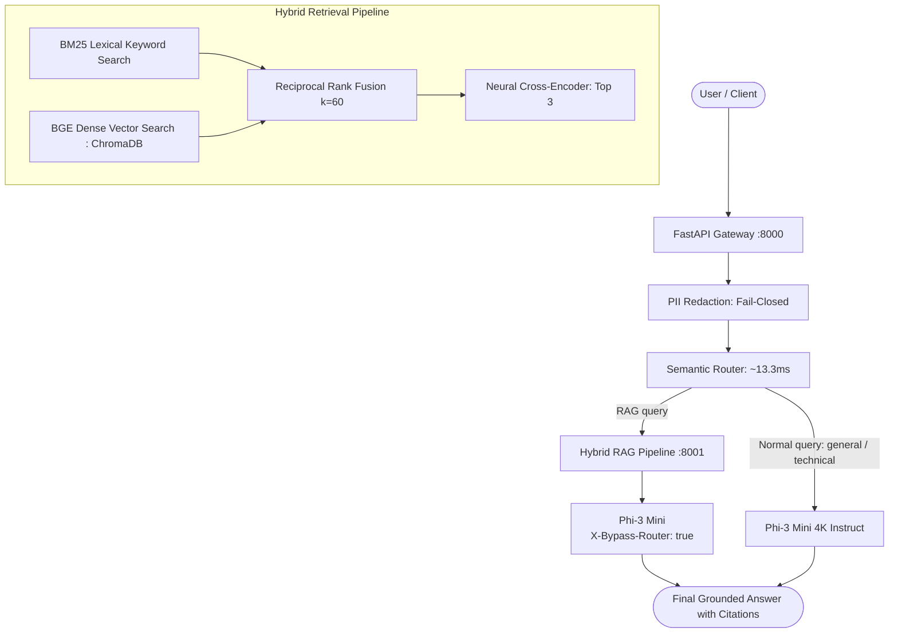

# Local GenAI Stack: SLM Gateway & Hybrid RAG Pipeline

A privacy-focused, fully local Generative AI stack combining an **OpenAI-Compatible SLM Gateway** with a **Two-Stage Hybrid RAG Pipeline (BM25 + Dense Vectors + Cross-Encoder Re-Ranking)**. Built to run locally with open-weights models (`microsoft/Phi-3-mini-4k-instruct`, `BAAI/bge-small-en-v1.5`, `BAAI/bge-reranker-base`), ensuring zero cloud data egress and complete data privacy.


---

## 1. System Architecture

```
                    USER / CLIENT
                          │
                          ▼
                  ┌──────────────┐
                  │ FastAPI      │
                  │ Gateway      │
                  └──────┬───────┘
                         │
                         ▼
                   PII Redaction (Presidio + Codename Deny-list)
                         │
                         ▼
                  Semantic Router (MiniLM / BGE Embeddings)
                     /       \
                    /         \
              Normal query    RAG query
                  │              │
                  ▼              ▼
              Phi-3 Mini     Hybrid RAG Pipeline
                                 │
                           ┌─────┴─────┐
                           │           │
                        Documents    Query
                           │           │
                         Parse       Hybrid Search
                           │       ┌───┴───┐
                        Chunk      │ BM25  │ Dense (ChromaDB)
                           │       └───┬───┘
                        Embed          │
                           │      Reciprocal Rank Fusion (RRF)
                        Store          │
                                   Top Chunks
                                       │
                               Cross-Encoder Reranker
                                       │
                                     Top 3
                                       │
                                       ▼
                                   Phi-3 Mini
                                       │
                                       ▼
                                    Answer
```



---

## 2. Quickstart

### Prerequisites
- Python 3.10
- `uv` package manager (or standard virtualenv)
- NVIDIA GPU recommended for in-process 4-bit model serving (or CPU fallback via `BACKEND=openai_compatible`)

### Run Services
```bash
# Terminal 1: Start RAG Service (Port 8001)
uv run --project rag uvicorn rag_service.main:app --host 0.0.0.0 --port 8001

# Terminal 2: Start SLM Gateway (Port 8000)
uv run --project gateway uvicorn slm_gateway.main:app --host 0.0.0.0 --port 8000
```

### Interactive Web Playground
When the Gateway is running on port 8000, visit the interactive Web Playground directly in your browser:
```text
http://localhost:8000/
http://localhost:8000/playground
```
Features:
- **Live SSE Token Streaming**: Real-time typewriter effect with token generation.
- **PII Sanitizer Lab**: Side-by-side comparison of raw prompts vs redacted model inputs with colored entity pills.
- **Semantic Intent Radar**: Live visualization of intent similarity scores and threshold fallback.
- **Hybrid RAG Inspector**: Query search showing dense, BM25, RRF, and cross-encoder scores per chunk.
- **Document Ingest & Corpus Manager**: Drag-and-drop document upload with multi-strategy chunk indexing and real-time inventory management.
- **Prometheus Scrape Viewer**: Inspect `/metrics` directly from the UI.

### Run the Benchmarks & Scorecard
```bash
# View the unified benchmark scorecard dashboard:
uv run python scripts/run_benchmarks.py --scorecard-only

# Or execute specific benchmark pipelines:
uv run python scripts/run_benchmarks.py --suite pii       # PII recall & false positives
uv run python scripts/run_benchmarks.py --suite router    # Intent classification & threshold sweep
uv run python scripts/run_benchmarks.py --suite chunking  # Multi-strategy chunking & re-ranking
uv run python scripts/run_benchmarks.py --suite hybrid    # BM25 + BGE dense RRF benchmark
```

### Run the Demo
```bash
# Live 4-scene demo: health check, normal chat, PII masking, RAG query with sources
uv run python scripts/demo.py

# Or inspect the empirical benchmark table directly:
uv run python scripts/demo.py --benchmark-only
```

### Run the Tests
```bash
# Run all unit and integration tests:
uv run pytest gateway/tests rag/tests -m "not slow"
```

---

## 3. Key Evaluation Results (Supporting Evidence)

### 3.1 Chunking Strategy & Re-Ranking
Evaluated across 36 ground-truth questions on a small synthetic corpus (3 PDFs / 5 pages from `scripts/create_eval_docs.py`):

| Strategy | Re-ranker | Total Chunks | Avg Length | Hit@1 (%) | Hit@3 (%) | MRR | Latency (ms) |
|---|:---:|:---:|:---:|:---:|:---:|:---:|:---:|
| `character` | Off | 16 | 423.6 ch | 86.11% | 100.00% | 0.9213 | 16.9 |
| `character` | On | 16 | 423.6 ch | 88.89% | 97.22% | 0.9306 | 2340.3 |
| `structure` | Off | 10 | 623.6 ch | 94.44% | 100.00% | 0.9722 | 14.7 |
| **`structure`** | **On** | **10** | **623.6 ch** | **100.00%** | **100.00%** | **1.0000** | **5634.3** |
| `semantic` | Off | 16 | 388.7 ch | 88.89% | 100.00% | 0.9352 | 114.9 |
| **`semantic`** | **On** | **16** | **388.7 ch** | **94.44%** | **97.22%** | **0.9583** | **4183.3** |

*Takeaways*:
- Cross-encoder re-ranking improved Hit@1 for structure (+5.56%) and semantic (+5.55%).
- Re-ranking character chunking improved Hit@1 from 86.1% to 88.9%, but slightly reduced Hit@3, possibly because severed sentences lack full context for cross-attention.
- Dense search provides ~15-20ms lookup, while cross-encoder inference on CPU adds noticeable latency without GPU acceleration.

### 3.2 Hybrid Retrieval & Reciprocal Rank Fusion (RRF)
Evaluated across 24 test queries (12 exact keyword/acronym + 12 conceptual paraphrase) over 4 technical documents (`eval/datasets/hybrid_eval.jsonl`):

| Configuration | Re-Ranker | RRF $k$ | Keyword Hit@1 | Conceptual Hit@1 | Overall Hit@1 | Overall Hit@3 | MRR |
|:---|:---:|:---:|:---:|:---:|:---:|:---:|:---:|
| **BM25 Lexical Only** | Off | — | **100.0%** | 41.7% | 70.83% | 75.00% | 0.7292 |
| **BGE Dense Vector Only** | Off | — | 91.7% | 33.3% | 62.50% | 75.00% | 0.6806 |
| **Hybrid (BM25 + Dense RRF)** | Off | 60 | 91.7% | **41.7%** | 66.67% | 75.00% | 0.7083 |
| **Hybrid + Cross-Encoder** | **On** | **60** | **100.0%** | 25.0% | 62.50% | **79.17%** | 0.7014 |

*Takeaways*:
- Lexical BM25 excels at exact keyword and acronym queries (`100% Hit@1`) but degrades on conceptual paraphrasing.
- Dense embeddings capture semantic intent without exact vocabulary overlap.
- Hybrid fusion with Reciprocal Rank Fusion ($k=60$) balances both modalities, ensuring zero keyword regressions.

### 3.3 Semantic Intent Router Accuracy
Evaluated on 48 held-out synthetic queries with 0 training exemplar leakage (`eval/datasets/router_eval.jsonl`):

| Intent | Support | Precision | Recall | F1-Score |
|---|:---:|:---:|:---:|:---:|
| `general` | 16 | 100.0% | 93.8% | 96.8% |
| `technical` | 16 | 88.2% | 93.8% | 90.9% |
| `rag` | 16 | 93.8% | 93.8% | 93.8% |
| **Overall** | **48** | **93.75% Accuracy (45/48)** | — | — |

*Operating threshold: `0.55`. Mean classification latency: `13.34 ms` (P50: `13.31 ms`, P95: `16.13 ms`).*

---

## 4. Documentation & Architecture Reference
- [docs/RESUME_PORTFOLIO.md](docs/RESUME_PORTFOLIO.md): **Resume bullet points, quantifiable metrics, and technical interview Q&A guide.**
- [docs/KNOWN_LIMITATIONS.md](docs/KNOWN_LIMITATIONS.md): Operational boundaries and production trade-offs catalog.
- [docs/ARCHITECTURE.md](docs/ARCHITECTURE.md): Architecture diagram and request flow.
- [docs/SOLUTION_GATEWAY.md](docs/SOLUTION_GATEWAY.md): Gateway design, API spec, and limitations.
- [docs/SOLUTION_RAG.md](docs/SOLUTION_RAG.md): RAG design, chunking strategies, and limitations.

---

## 5. License
Distributed under the [MIT License](LICENSE).
