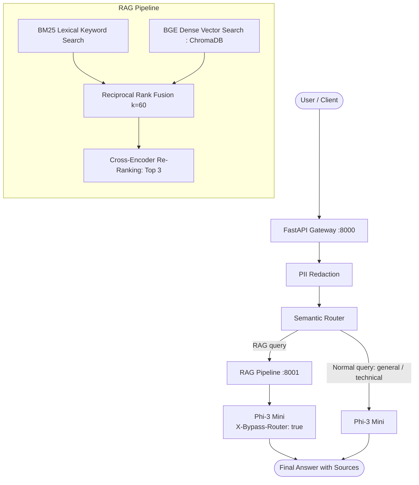

# System Architecture: Local GenAI Stack

This document specifies the simplified, end-to-end architecture connecting the **SLM Gateway** (`slm_gateway`, port 8000) and the **RAG Service** (`rag_service`, port 8001).

---

## 1. System Architecture Diagram

```
                    USER
                      │
                      ▼
              ┌──────────────┐
              │ FastAPI      │
              │ Gateway      │
              └──────┬───────┘
                     │
                     ▼
               PII Redaction
                     │
                     ▼
              Semantic Router
                 /       \
                /         \
          Normal query    RAG query
              │              │
              ▼              ▼
          Phi-3 Mini     RAG Pipeline
                             │
                       ┌─────┴─────┐
                       │           │
                    Documents    Query
                       │           │
                     Parse       Embed
                       │           │
                    Chunk      ChromaDB
                       │           │
                    Embed      Top 20
                       │           │
                    Store     Reranker
                                   │
                                  Top 3
                                   │
                                   ▼
                              Phi-3 Mini
                                   │
                                   ▼
                                Answer
```



---

## 2. End-to-End Request Flow

1. **Client Request**: The client sends a standard OpenAI `POST /v1/chat/completions` request to the Gateway on port 8000.
2. **PII Masking**: The Gateway's Presidio pipeline intercepts incoming `user` messages, masking sensitive entities (`PERSON`, `EMAIL_ADDRESS`, `PHONE_NUMBER`, `CREDIT_CARD`, `IP_ADDRESS`, and custom `EMPLOYEE_ID`) into typed placeholders (e.g., `<EMAIL_ADDRESS>`). Location and date nouns are preserved.
3. **Intent Classification**: The Intent Router embeds the query using `BAAI/bge-small-en-v1.5` and computes cosine similarity against exemplar sentences, classifying the query into `general`, `technical`, or `rag`.
4. **Branch A — Normal Query (`general`, `technical`)**:
   - The Gateway passes the prompt directly to the in-process `microsoft/Phi-3-mini-4k-instruct` model (4-bit NF4 quantization) guarded by an `asyncio.Semaphore(1)` to serialize generation.
   - Returns standard OpenAI chat completion JSON or SSE stream.
5. **Branch B — RAG Query (`rag`)**:
   - The Gateway delegates the query to `POST http://rag:8001/answer`.
   - **Document Ingestion (Background/Setup)**: PDFs and DOCX files are parsed, chunked via one of three strategies (`character`, `structure`, `semantic`), embedded with BGE-small, and stored in ChromaDB and BM25 index.
   - **Hybrid Retrieval**: Candidate chunks are scored via BM25 lexical search and BGE dense vector cosine search, then fused using Reciprocal Rank Fusion (RRF, $k=60$).
   - **Cross-Encoder Re-Ranking**: `BAAI/bge-reranker-base` re-ranks candidate chunks and retains the top 3 chunks.
   - **Grounded Answer Synthesis**: The top 3 chunks are formatted into numbered context brackets (`[1]`, `[2]`, `[3]`). The RAG service calls back to the Gateway `/v1/chat/completions` with the header `X-Bypass-Router: true`.
   - **Loop Prevention**: The Gateway detects `X-Bypass-Router: true`, skips intent routing, executes local Phi-3 generation directly, and returns the grounded answer with sources.

---

## 3. Core Component Responsibilities

| Component | Responsibility | Technical Foundation |
|---|---|---|
| **FastAPI Gateway** (:8000) | Public API entry point, OpenAI schema compliance. | FastAPI, Pydantic |
| **Model Serving** | In-process local inference in 4-bit NF4. | HuggingFace Transformers, bitsandbytes |
| **PII Redaction** | Strips personal and employee identifiers before inference. | Microsoft Presidio, spaCy `en_core_web_sm` |
| **Semantic Router** | Classifies query intent without an LLM call. | BGE-small embeddings, cosine similarity |
| **Document Parsers** | Digital text extraction from PDF and DOCX files. | PyMuPDF, python-docx |
| **Chunking Engine** | 3 independent strategies: Character, Structure, Semantic. | Custom modular chunkers |
| **Vector Storage** | Persistent local vector storage. | ChromaDB |
| **Two-Stage Retrieval** | Top-20 dense lookup followed by Top-3 cross-attention re-ranking. | BGE-small, `BAAI/bge-reranker-base` |
