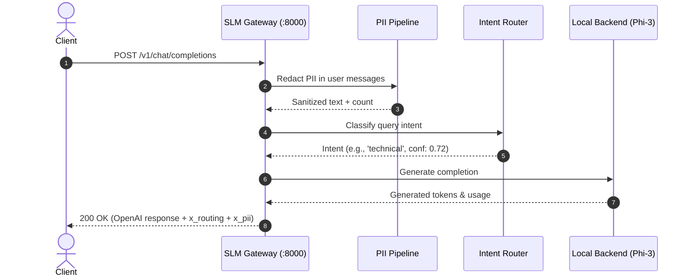
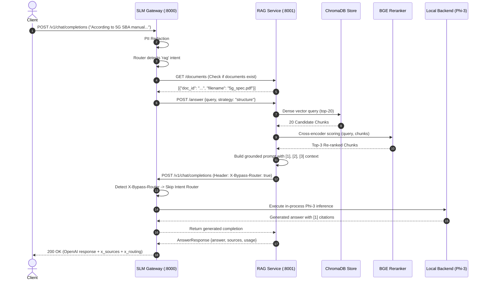

# System Architecture Specification: Local Enterprise GenAI Stack

This document provides the authoritative architectural specification for the Ericsson Local GenAI Stack, comprising the **SLM Gateway** (`slm_gateway`, port 8000) and the **Hybrid RAG Service** (`rag_service`, port 8001).

---

## 1. High-Level System Context

The system runs entirely locally on edge/workstation infrastructure using open-weights models. No data or prompts leave the deployment environment.

```mermaid
graph TD
    Client[Enterprise Client / API Consumer] -->|POST /v1/chat/completions| Gateway[SLM Gateway :8000]
    
    subgraph Gateway Subsystems
        Auth[Optional Bearer Auth]
        PII[Presidio PII Redaction Pipeline]
        Router[BGE Semantic Intent Router]
        ModelBackend[Phi-3-Mini 4k Model Backend]
    end
    
    Gateway --> Auth
    Auth --> PII
    PII --> Router
    
    Router -->|general / technical / structured_json| ModelBackend
    Router -->|rag intent| RAGClient[Gateway RAG Client]
    
    subgraph RAG Microservice :8001
        Ingestion[Document Ingestion & Parsers]
        Chunkers[Chunking: Character | Structure | Semantic]
        VectorStore[(ChromaDB Collections)]
        DenseRetriever[BGE-small Dense Retrieval k=20]
        CrossReranker[BGE-Reranker-Base Cross-Encoder k=3]
        Generator[Grounded Prompt Synthesizer]
    end
    
    RAGClient -->|POST /answer| Generator
    Generator --> DenseRetriever
    DenseRetriever --> VectorStore
    DenseRetriever --> CrossReranker
    CrossReranker --> Generator
    Generator -->|POST /v1/chat/completions<br/>X-Bypass-Router: true| ModelBackend
    
    ModelBackend -->|Stream / Tokens| Gateway
    Gateway -->|OpenAI-Compatible Chat Completion<br/>+ x_routing, x_pii, x_sources| Client
```

---

## 2. Microservice Responsibilities & Decoupling

| Responsibility | SLM Gateway (Port 8000) | RAG Service (Port 8001) | Rationale |
|---|:---:|:---:|---|
| **API Entry Point** | **Yes** (Single Front Door) | No (Internal Backend) | Client applications interface with one uniform OpenAI-compatible API. |
| **Model In-Process Weights** | **Yes** (Phi-3-mini 4-bit) | No (0 VRAM for generation) | Avoids duplicate GPU memory allocation and fragmentation. |
| **PII Redaction** | **Yes** (Presidio + Custom) | No | Every inbound prompt is sanitized before vector search or LLM generation. |
| **Intent Routing** | **Yes** (BGE-small embeddings) | No | Eliminates unnecessary RAG pipeline invocations for general queries. |
| **Document Parsing** | No | **Yes** (PyMuPDF, python-docx) | Isolates file format handling and memory spikes. |
| **Chunking Strategies** | No | **Yes** (3 isolated strategies) | Modular chunking logic independent of gateway routing. |
| **Vector Storage** | No | **Yes** (ChromaDB persistent) | Persisted on disk, decouples vector graph maintenance. |
| **Neural Re-ranking** | No | **Yes** (BGE Cross-Encoder) | Two-stage candidate filtering localized to RAG domain. |

---

## 3. Detailed Request Flows

### 3.1 Direct Query Flow (`general`, `technical`, `structured_json`)

1. **Client** issues `POST /v1/chat/completions` with user prompt.
2. **Gateway Auth**: Validates bearer token if `GATEWAY_API_KEY` is configured.
3. **PII Masking**: Scans all `user` role messages with Presidio Analyzer (`PERSON`, `EMAIL_ADDRESS`, `PHONE_NUMBER`, `CREDIT_CARD`, `IP_ADDRESS`, `EMPLOYEE_ID`, `PROJECT_CODENAME`). Replaces detected entities with typed tokens (e.g., `<EMAIL_ADDRESS>`). Records redaction count.
4. **Intent Classification**: Evaluates the latest query embedding against exemplar centroids across `general`, `technical`, `structured_json`, and `rag`.
5. **Special Handling**:
   - `structured_json`: Injects a strict JSON-enforcement system prompt.
6. **Local LLM Generation**: In-process Phi-3 Mini generates response tokens under single-GPU semaphore.
7. **Response Packaging**: Wraps output into OpenAI chat completion schema with custom metadata `x_routing` and `x_pii`.



---

### 3.2 Grounded RAG Query Flow (`rag` Intent)

When a query is classified as `rag`:



---

## 4. Loop Prevention Mechanism (`X-Bypass-Router`)

Because the RAG service calls the Gateway's `/v1/chat/completions` endpoint for text generation, circular delegation could occur if the Gateway re-classified the RAG prompt as a `rag` query:

$$\text{Client} \to \text{Gateway} \to \text{RAG} \to \text{Gateway} \to \text{RAG} \to \dots \quad \text{(Infinite Loop)}$$

### Resolution:
- RAG generation passes the internal header:
  ```http
  X-Bypass-Router: true
  ```
- Gateway routing checks:
  ```python
  if bypass_router:
      # Bypass router entirely, route directly to local LLM backend
      route_target = "hf_local"
  ```
- **Guarantees:** Zero architectural loops, no secondary internal port required, unified token tracking, and centralized PII safety.

---

## 5. Fault Tolerance & Fallback Strategies

| Failure Scenario | Gateway Handling | Consumer Impact |
|---|---|---|
| **Zero Documents in RAG** | `has_indexed_documents()` returns `False`. Downgrades route to `hf_local`. | Query is answered by base model. `x_routing.warning` alerts user. `x_sources=None`. |
| **RAG Service Down / Unreachable** | Catches `httpx.ConnectError` / `Timeout`. Downgrades route to `hf_local`. | Service remains 100% available. `x_routing.warning` informs operator. |
| **Presidio Initialization Failure** | `PII_FAIL_MODE=closed` prevents startup (`sys.exit(1)`). | Prevents unredacted leaks in enterprise environment. |
| **Empty Vector Retrieval** | Retrieval returns 0 chunks. RAG synthesizes polite negative: *"The indexed documents do not contain information..."* | User receives accurate negative assertion without hallucination. |

---

## 6. Storage & Vector DB Architecture

ChromaDB operates with local persistent storage (`data/chroma`). To prevent vector space cross-contamination, separate HNSW graph collections are maintained:

```
data/chroma/
├── chunks_character/   # Fixed-size whitespace-snapped chunks (500 chars)
├── chunks_structure/   # Markdown/heading & paragraph-aware chunks
└── chunks_semantic/    # Sentence-embedding cosine boundary chunks
```

Each chunk record contains:
- `id`: `<doc_id>_<strategy>_p<page>_<chunk_index>` (guaranteed unique)
- `embedding`: 384-dimensional normalized float32 vector (`BAAI/bge-small-en-v1.5`)
- `document`: Raw text content
- `metadata`: `{"doc_id": "...", "source": "filename.pdf", "page": 1, "strategy": "..."}`
