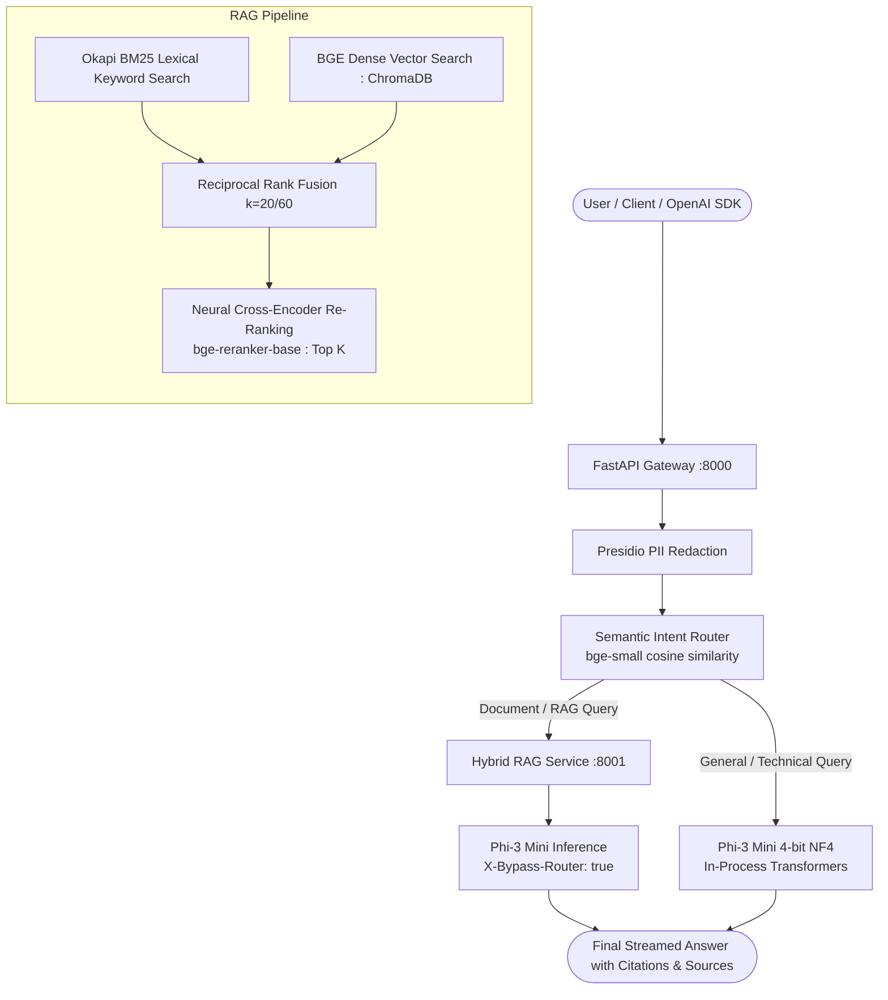

# System Architecture: Local GenAI Stack

This document specifies the end-to-end architecture connecting the **SLM Gateway** (`slm_gateway`, port 8000) and the **RAG Service** (`rag_service`, port 8001).

---

## 1. System Architecture Diagram



---

## 2. End-to-End Request Flow

1. **Client Request**: The client sends a standard OpenAI `POST /v1/chat/completions` request to the Gateway on port 8000.
2. **PII Masking**: The Gateway's Presidio pipeline intercepts incoming messages, replacing sensitive identifiers (`PERSON`, `EMAIL_ADDRESS`, `PHONE_NUMBER`, `CREDIT_CARD`, `IP_ADDRESS`, and custom `EMPLOYEE_ID`) with typed placeholders (e.g., `<EMAIL_ADDRESS>`). Locations and dates are deliberately preserved.
3. **Intent Classification**: The Intent Router embeds the query using `BAAI/bge-small-en-v1.5` and computes cosine similarity against exemplar sentences, classifying the query into `general`, `technical`, or `rag`.
4. **Branch A — Direct Model Query (`general`, `technical`)**:
   - The Gateway passes the prompt directly to the in-process `microsoft/Phi-3-mini-4k-instruct` model (4-bit NF4 quantization) guarded by a bounded inference queue.
   - Returns standard OpenAI chat completion JSON or true SSE token stream.
5. **Branch B — Grounded RAG Query (`rag`)**:
   - The Gateway delegates the query to `POST http://rag:8001/answer` (or proxies true token streaming via `POST http://rag:8001/chat/completions`).
   - **Document Ingestion (Background/Setup)**: Documents (`.pdf`, `.docx`, `.txt`, `.md`) are parsed, chunked via one of three strategies (`character`, `structure`, `semantic`), embedded with BGE-small, and indexed into ChromaDB and an Okapi BM25 index.
   - **Hybrid Retrieval**: Candidate chunks are retrieved via BM25 lexical search and BGE dense vector search, then fused using Reciprocal Rank Fusion (RRF, $k=20$ or $k=60$).
   - **Cross-Encoder Re-Ranking**: `BAAI/bge-reranker-base` re-ranks candidate chunks. If scores fall below refusal threshold, an honest "insufficient context" message is returned.
   - **Grounded Answer Synthesis**: Top chunks are formatted into numbered context brackets (`[1]`, `[2]`). The RAG service calls back to the Gateway `/v1/chat/completions` with the header `X-Bypass-Router: true`.
   - **Loop Prevention**: The Gateway detects `X-Bypass-Router: true`, skips intent routing, executes local Phi-3 generation directly, and streams the grounded answer with sources.

---

## 3. Core Component Responsibilities

| Component | Responsibility | Technical Foundation |
|---|---|---|
| **FastAPI Gateway** (:8000) | Public API entry point, OpenAI schema compliance, PII redaction, intent routing. | FastAPI, Pydantic, Uvicorn |
| **Model Serving** | In-process local inference in 4-bit NF4 with bounded queue. | HuggingFace Transformers, bitsandbytes |
| **PII Redaction** | Strips personal and employee identifiers before inference (fail-closed mode). | Microsoft Presidio, spaCy `en_core_web_sm` |
| **Semantic Router** | Classifies query intent without an expensive LLM call (~64ms CPU mean). | BGE-small embeddings, cosine similarity |
| **Document Parsers** | Digital text & table extraction from PDF, DOCX, TXT, and Markdown files. | PyMuPDF, python-docx |
| **Chunking Engine** | 3 independent strategies: Character (sliding window), Structure, Semantic. | Custom modular chunkers |
| **Vector Storage** | Persistent local vector storage and collection management. | ChromaDB |
| **Two-Stage Retrieval** | Top-20 dense + BM25 fusion followed by Top-K cross-attention re-ranking. | Okapi BM25, `bge-small`, `bge-reranker-base` |

---

## 4. Key Design Decisions & Architectural Rationale

### 4.1 Why Phi-3 Mini (3.8B)?
- **Hardware Footprint**: Quantized to 4-bit NormalFloat (NF4) via bitsandbytes, the 3.8-billion parameter model runs locally on consumer GPUs (or fallback CPU inference) while leaving memory for embedding and reranker models.
- **Reasoning Density**: Trained on heavily curated synthetic datasets and filtered web texts, Phi-3 Mini rivals or outperforms 7B–14B models on MMLU, GSM8K, and coding benchmarks while running at significantly higher tokens/second.
- **Instruct Tuning**: Native support for instruction/chat templates (`<|user|>`, `<|assistant|>`, `<|system|>`) simplifies structured prompt injection.

### 4.2 Why a Separate RAG Service (Port 8001) from the Gateway (Port 8000)?
- **Separation of Concerns**: The Gateway acts as the secure, lightweight front door (handling OpenAI schema compatibility, rate limiting, request validation, and PII redaction). The RAG service is an I/O and compute-heavy document processing service (handling file parsing, chunking, ChromaDB persistence, BM25 indexing, and cross-encoder re-ranking).
- **Independent Scaling & Isolation**: In production, document ingestion (e.g. processing a 100-page PDF with OCR) will not starve or block real-time conversational chat completions. Services can be scaled or updated independently.

### 4.3 Why Fail-Closed PII Mode by Default?
- **Enterprise Privacy Posture**: In private enterprise deployments handling confidential customer or employee data, a failure in the sanitization pipeline (e.g. corrupt spaCy models, missing entity recognizers) must never silently expose unmasked PII to language models.
- **Configurable Flexibility**: In `closed` mode, the service raises an exception during startup and refuses traffic. In `open` mode (enabled via `PII_FAIL_MODE=open`), the gateway logs a loud warning and continues serving.

### 4.4 Why an Embedding Router vs. an LLM-Based Router?
- **Low Latency vs. Generative Overhead**: Embedding a query with `BAAI/bge-small-en-v1.5` and computing cosine similarity against exemplar vectors takes **~64 ms on CPU** (mean). In contrast, calling an LLM to output a JSON classification takes 500–1,500 ms and consumes generation context tokens.
- **Deterministic Thresholding**: Cosine similarity produces deterministic numerical scores, allowing strict threshold enforcement (e.g. falling back to `general` if similarity is under `0.55`).

---

## 5. Official OpenAI Python SDK Integration Example

Because the SLM Gateway strictly implements the OpenAI REST API specification (`/v1/chat/completions` and `/v1/models`), you can drop the official `openai` Python SDK in directly:

```python
import os
from openai import OpenAI

# Initialize client pointing to local SLM Gateway
client = OpenAI(
    base_url="http://localhost:8000/v1",
    api_key=os.environ.get("GATEWAY_API_KEY", "not-needed-locally"),
)

# 1. Standard Chat Completion (Streaming)
stream = client.chat.completions.create(
    model="microsoft/Phi-3-mini-4k-instruct",
    messages=[
        {"role": "system", "content": "You are a concise technical assistant."},
        {"role": "user", "content": "Explain how Raft handles leader heartbeats."},
    ],
    stream=True,
    temperature=0.7,
)

print("Assistant: ", end="", flush=True)
for chunk in stream:
    token = chunk.choices[0].delta.content or ""
    print(token, end="", flush=True)
print()

# 2. Grounded RAG Query (Routes automatically to RAG pipeline)
response = client.chat.completions.create(
    model="microsoft/Phi-3-mini-4k-instruct",
    messages=[
        {
            "role": "user",
            "content": "According to the uploaded documents, what are the core components of the 5G Core architecture?",
        }
    ],
    stream=False,
)

print("\nRAG Answer:\n", response.choices[0].message.content)
```

---

## 6. System Boundaries & Known Limitations

- **Concurrency**: Local in-process GPU generation is serialized via a bounded queue (`MAX_CONCURRENT_INFERENCE=1`, `INFERENCE_QUEUE_TIMEOUT_SECONDS=10.0`) to avoid CUDA Out-Of-Memory exceptions.
- **OCR Quality**: Scanned PDFs fall back to Tesseract OCR when installed on the host. Highly degraded scans or handwritten text are not guaranteed.
- **Further Operational Boundaries**: See [docs/KNOWN_LIMITATIONS.md](KNOWN_LIMITATIONS.md) for full operational limits and resource trade-offs.
