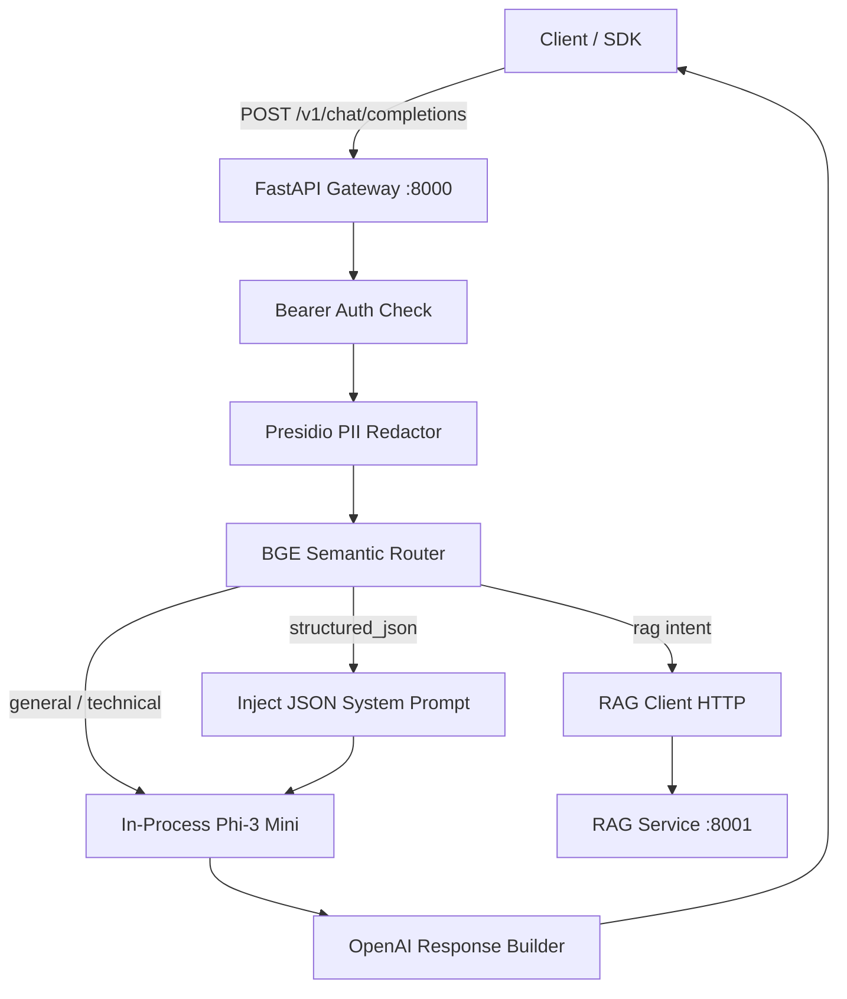

# SLM Gateway

The **SLM Gateway** is an enterprise-grade API gateway and inference router that wraps small language models (Phi-3-mini-4k-instruct) in an OpenAI-compatible interface, enforces client-side PII privacy policies, and dynamically routes requests based on semantic intent embeddings.

---

## Features

- **OpenAI-Compatible `/v1/chat/completions`**: Seamlessly integrates with the official `openai` Python SDK, LangChain, LlamaIndex, or any OpenAI-compatible client.
- **In-Process Model Serving (`hf_local`)**: Loads `microsoft/Phi-3-mini-4k-instruct` in 4-bit NF4 quantization via `bitsandbytes`, guarded by an async semaphore for single-GPU stability.
- **Pluggable External Backends (`openai_compatible`)**: Supports proxying to external vLLM, Ollama, or OpenAI-compatible endpoints for CPU-only dev setups or distributed clusters.
- **Client-Side PII Masking**: Microsoft Presidio analyzer with custom enterprise recognizers (`EMPLOYEE_ID`, `PROJECT_CODENAME`) and a fail-closed privacy policy. Geographic names (`LOCATION`) and dates (`DATE_TIME`) are deliberately preserved to prevent search corruption.
- **Semantic Intent Router**: Classifies queries across 4 intents (`general`, `technical`, `structured_json`, `rag`) in ~60ms using `BAAI/bge-small-en-v1.5` embeddings.
- **Loop-Safe RAG Delegation**: Routes document questions to the RAG service and accepts generation callbacks safely using `X-Bypass-Router: true`.

---

## Architecture Diagram



---

## Quickstart

### 1. Local Environment (uv)

```bash
# Navigate to repo root and start gateway
uv run uvicorn slm_gateway.main:app --host 0.0.0.0 --port 8000
```

Verify service readiness:
```bash
curl http://localhost:8000/ready
```

### 2. Docker Container

Build and run the standalone gateway container:
```bash
docker build -t slm-gateway -f gateway/Dockerfile ./gateway
docker run -p 8000:8000 --env-file .env slm-gateway
```

*(For GPU passthrough on Linux/WSL2, install `nvidia-container-toolkit` and add `--gpus all`)*

---

## Configuration Reference

All settings can be configured via environment variables or a `.env` file:

| Variable | Type | Default | Description |
|---|:---:|:---:|---|
| `HOST` | string | `0.0.0.0` | Bind host address |
| `PORT` | int | `8000` | Bind port |
| `BACKEND` | string | `hf_local` | LLM backend: `hf_local` (in-process) or `openai_compatible` (proxy) |
| `MODEL_ID` | string | `microsoft/Phi-3-mini-4k-instruct` | HuggingFace model identifier |
| `QUANTIZE` | string | `4bit` | Quantization: `4bit` (NF4 via bitsandbytes) or `none` |
| `DEVICE` | string | `auto` | PyTorch device mapping (`auto`, `cuda`, `cpu`) |
| `MAX_CONTEXT_LENGTH` | int | `4096` | Maximum token context window |
| `DEFAULT_MAX_TOKENS` | int | `512` | Default completion tokens |
| `DEFAULT_TEMPERATURE` | float | `0.7` | Sampling temperature |
| `DEFAULT_TOP_P` | float | `1.0` | Nucleus sampling probability |
| `BACKEND_URL` | string | `http://localhost:8000` | Target URL when `BACKEND=openai_compatible` |
| `GATEWAY_API_KEY` | string | `None` | Optional Bearer authentication secret |
| `PII_FAIL_MODE` | string | `closed` | `closed` (abort on error) or `open` (warn and bypass) |
| `PROJECT_CODENAMES` | string | `Project-Titan,...` | Comma-separated list of internal project codenames to redact |
| `ROUTER_MODEL_NAME` | string | `BAAI/bge-small-en-v1.5` | Embedding model for semantic router |
| `ROUTER_THRESHOLD` | float | `0.55` | Cosine similarity threshold for intent fallback |
| `RAG_SERVICE_URL` | string | `http://localhost:8001` | RAG service base URL |
| `RAG_TIMEOUT_SECONDS` | float | `30.0` | HTTP timeout when delegating to RAG service |

---

## API Specification & Examples

### Chat Completion via `curl`

```bash
curl -X POST http://localhost:8000/v1/chat/completions \
  -H "Content-Type: application/json" \
  -d '{
    "messages": [
      {"role": "user", "content": "What is 5G SBA?"}
    ],
    "temperature": 0.7,
    "max_tokens": 100
  }'
```

### Chat Completion via Official `openai` Python SDK

```python
from openai import OpenAI

client = OpenAI(
    base_url="http://localhost:8000/v1",
    api_key="not-needed"  # or GATEWAY_API_KEY if configured
)

response = client.chat.completions.create(
    model="microsoft/Phi-3-mini-4k-instruct",
    messages=[
        {"role": "user", "content": "Hello from OpenAI Python SDK!"}
    ]
)

print("Answer:", response.choices[0].message.content)
print("Tokens:", response.usage.total_tokens)
```

---

## Testing

```bash
# Run all gateway unit and integration tests (excluding slow model loading)
uv run pytest gateway/tests/ -v -m "not slow"

# Run the real in-process model test (requires GPU and takes ~30s)
uv run pytest gateway/tests/test_phi3_slow.py -v
```

---

## Troubleshooting

- **CUDA Out of Memory (OOM)**: Ensure `QUANTIZE=4bit` is set in `.env` to run Phi-3 Mini within ~2.6GB of VRAM.
- **Port In Use**: Change `PORT=8002` in `.env` or terminate the conflicting process.
- **PII spaCy Model Missing**: Run `uv run python -m spacy download en_core_web_sm`.
